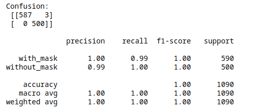
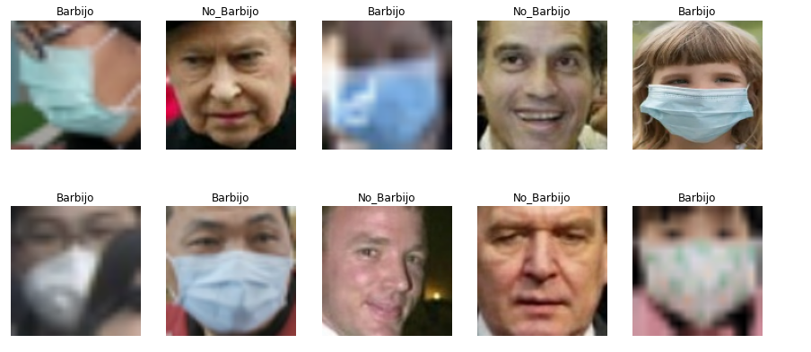
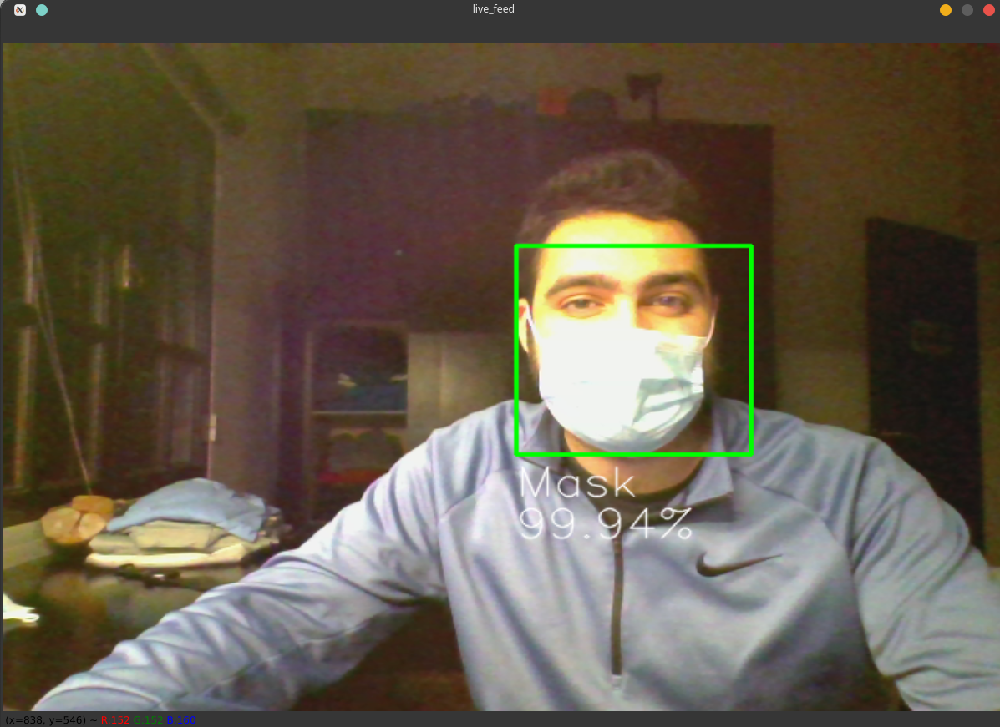

# Mask_Detector

Masks play a crucial role in protecting the health of individuals against respiratory diseases, as is one of the few precautions available for COVID-19 in the absence of immunization. Nowadays most hospitals, shops, offices, etc, often require the use of a mask to access the premises due to restrictions  to prevent the spread of the COVID-19 Virus. Normally there's someone in charge of enforcing these rules but with the help of AI we can automate this task, with high accuracy. 

## About the problem

We started with [This dataset](https://www.kaggle.com/datasets/andrewmvd/face-mask-detection) from kaggle which contained 853 images belonging to the 3 classes, as well as their bounding boxes. Those classes being:

- With mask;
- Without mask;
- Mask worn incorrectly.

We later realized that the daset quality was quite poor (*It lacked balance between its classes and the resolution of the images was quite small*) 
and we decided to add some data from other sources like the dataset from [faces on the wild](http://vis-www.cs.umass.edu/lfw/) and this dataset from a [hackathon](https://github.com/hydramst/hackathon_2021).  

Although we had more data, the data from mask worn incorrectly was too poor to use for the model, so we opted for a binary clasificator between those wearing a mask and those without it.

## Architecture used

As we decided to create a face mask detector for real time use, we ended up using MobileNetV2 architecture as a base for our model. We took this route because although its accuracy isn't at par with its competitors it compensates for its speed.


```python
BootstrapCCpy(cluster, K, B, n_cores)
```

## Getting started

Download this repository
```bash
git clone https://github.com/martin22ca/Mask_model.git
```
_Please check out dependencies section in case you are having trouble._

Download the zipfile containing the images from this link below

```dasda
https://drive.google.com/file/d/1SeUl23RBKm0YURgjiK2yBiKXS65xGHig/view?usp=sharing
```

## Usage
### Load data
First we load the data extracted from the zipfile in the 3 datasets, train, validation and testing
```python
train_ds = tf.keras.utils.image_dataset_from_directory(
    train_dir,
    labels='inferred',
    label_mode='categorical',
    batch_size=batch_size,
    image_size=(img_height, img_width),
    shuffle=True,
)
```
_Repeat the same for test and validation datasets_
### Weigh the classes accordingly

```python
lab =[]
for images, labels in train_ds.take(-1):  
    lab.extend(labels.numpy())

tru=[]
for i in lab:
    tru.append(np.argmax(i))
    

tru
class_weights = class_weight.compute_class_weight('balanced',
                                                  classes=np.unique(tru),
                                                  y=tru)
name = [0,1]
weight = dict(zip(name,class_weights))
```
### Data augmentation
Then we add some augmentation layers to change the imputs pictures slightly to prevent the overfitting of the model 
```python
data_augmentation = tf.keras.Sequential([
    layers.RandomFlip("horizontal"),
    layers.RandomRotation(0.1),
    layers.RandomBrightness(0.1, value_range=(1,250)),
    layers.RandomZoom(0.1),
    layers.RandomContrast(0.1)
])
```
### Create the model
```python
# Create base model with MobileNetV2 architecture
base_model = keras.applications.MobileNetV2(
    weights='imagenet',  # load pretrained ImageNet weights
    input_shape=(img_width, img_height, 3),
    include_top=False)  # Delete last layer of the model 

# Freeze pretrained weights
base_model.trainable = False

# Create the imput of our model
inputs= keras.Input(shape=(img_height, img_width, 3))

#  Augmentation
x = data_augmentation(inputs)

# Add a preprocessing layer specific to this architecture
x = keras.applications.mobilenet_v2.preprocess_input(x)

# Add both models
x = base_model(x, training=False)

# Convert our features vector into a 1-D vector
x = keras.layers.GlobalAveragePooling2D()(x)

# Add a Dropout layer to stop overfitting
x = keras.layers.Dropout(0.5)(x)

# Add a final layer with our classes
outputs = keras.layers.Dense(num_class, activation='softmax')(x)

# Final model
model = keras.Model(inputs, outputs)

model.summary()
```
### Compile the model
```python
opt = keras.optimizers.SGD(learning_rate=0.01)

# Compile the model
model.compile(
    optimizer=opt,
    loss='binary_crossentropy',
    metrics= ['accuracy']
)
model.summary()
```

### Train the model
```python
# Train the model
history = model.fit(
    train_ds,
    class_weight=weight,
    validation_data=val_ds,
    epochs=50,
    batch_size = batch_size,
    callbacks=my_callbacks
)
```
### History of the model 


## Results
To verify the effectivity of the model we use our test dataset, to ensure our model works in a real life environment



Some images with their predicted label 


## Demo 
You can test the model live by running the file 'Face_detection.ipynb', wich uses the face HOG recognition algorithm of Dlib to detect faces, and then uses the trained model to predict whether you are wearing a mask or not.

 
 
_The script only works with 3 people at max so not freeze the program_

## Authors

* [Caceres Martin](https://github.com/martin22ca) - Faculty of Engineering, Catholic University of Córdoba (UCC) *
* [Paschini Catalina](https://github.com/cata99) - Faculty of Engineering, Catholic University of Córdoba (UCC) *
* Ing. Pablo Pastore - DeepVisionAi, inc.
* [Bioing. PhD Elmer Fernández](https://github.com/elmerfer) - CIDIE-CONICET-UCC

*both authors must be considered as the first author